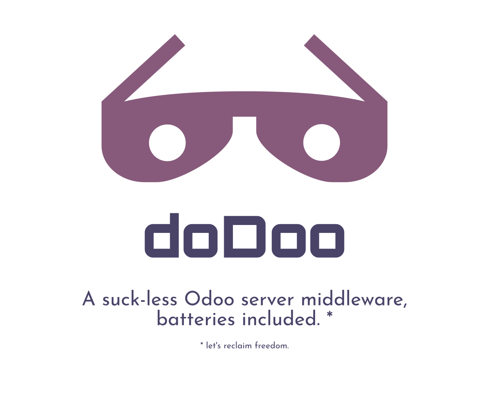

<div align="center">
  <div>
    
  </div>
  <br>
  <br>
  <a href="https://awesome.re">
    
  </a>
  <a href="https://github.com/xoe-labs/dodoo/blob/master/LICENSE">
    
  </a>
  <a href="https://pypi.org/project/dodoo">
    
  </a>
  <a href="https://matrix.to/#/#dodoo:matrix.org">
    
  </a>
  <p>
    <sub>Reference this page with <a href="https://github.com/xoe-labs/dodoo#readme"><code>https://github.com/xoe-labs/dodoo#readme</code></a>. Check out other <a href="https://github.com/OdooOps/awesome-odoo-ops#readme">awesome Odoo Ops</a> tools.</sub>
  </p>
  <p>
    <sub><a href="https://github.com/xoe-labs/dodoo#readme">dodoo</a> relates to <a href="https://github.com/OCA">OCA</a> in a very friendly way and strives to become OCA's UX optimized and enhanced reference Ops tooling.</sub>
  </p>
  <br>
</div>

## Quickstart

``` bash
$ pip3 install dodoo
$ dodoo --help
```

<sub>Before reaching GA, no particular effort will be put on docs except for a clean and easy to read code layout.</sub>

## Components

<sub>Not all components are implemented or operational. Meanwhile, this aims to be a compelling set of tooling to be made available through `dodoo`.</sub>

- `dodoo` - the Odoo Server middleware, done right *
- [`dodoo run`](https://github.com/xoe-labs/dodoo/tree/master/dodoo-run#readme) - run the suck-less odoo server
- [`dodoo init`](https://github.com/xoe-labs/dodoo/tree/master/dodoo-init#readme) - launch an Odoo database, eventually from a hashed db cache
- [`dodoo copy`](https://github.com/xoe-labs/dodoo/tree/master/dodoo-copy#readme) - copy an Odoo database and **augment** it
- [`dodoo backup`](https://github.com/xoe-labs/dodoo/tree/master/dodoo-backup#readme) - backup a database incrementally to "X" (disk, s3, sshfs, ...)
- [`dodoo test`](https://github.com/xoe-labs/dodoo/tree/master/dodoo-test#readme) - test your code with pytest and CI formateable output
- [`dodoo migrate`](https://github.com/xoe-labs/dodoo/tree/master/dodoo-migrate#readme) - manage the migration lifecycle end-to-end
- [`dodoo translate`](https://github.com/xoe-labs/dodoo/tree/master/dodoo-translate#readme) - export translation files to a translation server
- [`dodoo load`](https://github.com/xoe-labs/dodoo/tree/master/dodoo-load#readme) - state and boilerplate for ETL loading

\* "done right": no broken built-in scheduler, bare wsgi app, with json equivalent config for easy override, ssh-key for instance identity & backup encryption


## Contribute

- Just follow your instinct & open a PR.
- If you want to discuss with a person, join https://matrix.to/#/#dodoo:matrix.org.
- Be _somewhat_ familiar with:
    - [`odoo`](https://github.com/odoo/odoo)
    - [`tox`](https://tox.readthedocs.io/en/latest/)
    - [`pre-commit`](https://pre-commit.com/)
- Report issues at [DockeryOdoo](https://github.com/xoe-labs/dockery-odoo/issues>)

## Useful links

  - OdooOps Github Org: https://github.com/OdooOps
  - dockery-odoo: <https://xoe-labs.github.io/dockery-odoo/>
  - odooup: <https://github.com/xoe-labs/odooup>

## Credits

Contributors:

  - David Arnold ([XOE](https://xoe.solutions))


<div align="center">
  <div>
    <a href="https://xoe.solutions">
      
    </a>
  </div>
  <p>
  <sub>Currently, folks <a href="https://github.com/xoe-labs/">@xoe-labs</a> try to keep up with their task to maintain this.</sub>
  </p>
  <p>
  <sub>If you're the kind of person, willing to sponsor open source projects, consider sending some spare XLM banana to <code>blaggacao*keybase.io</code></sub>
  </p>
</div>
